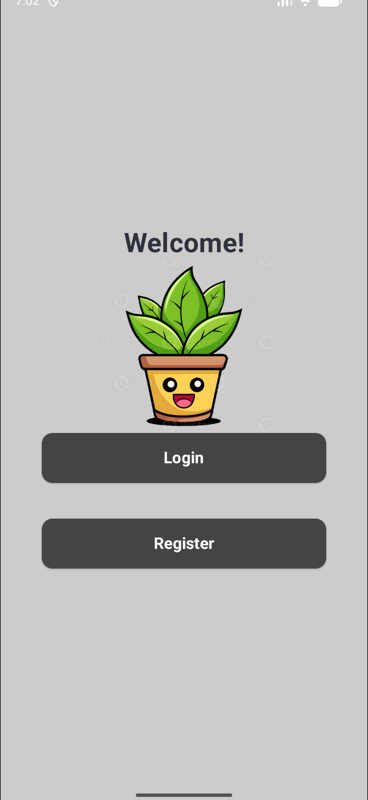
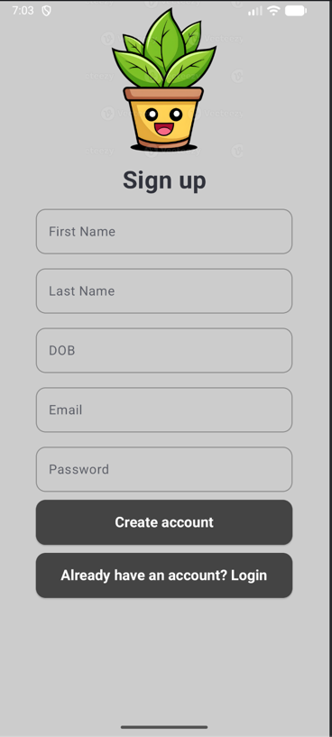
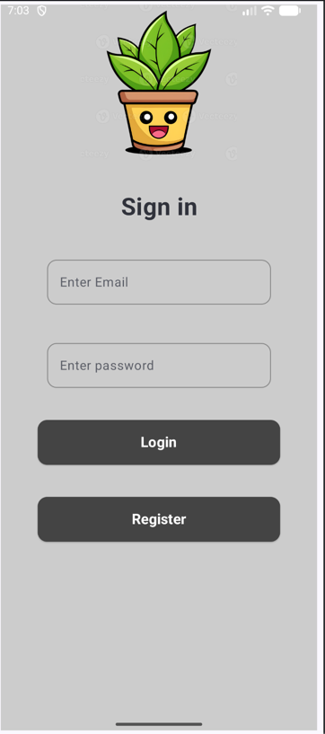
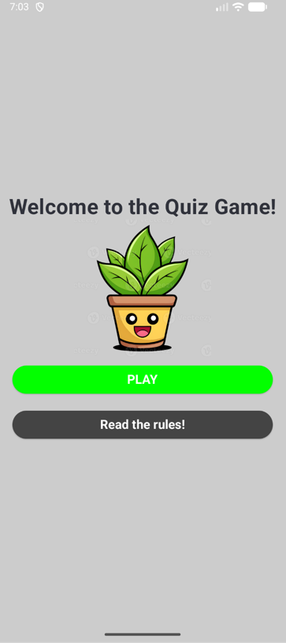
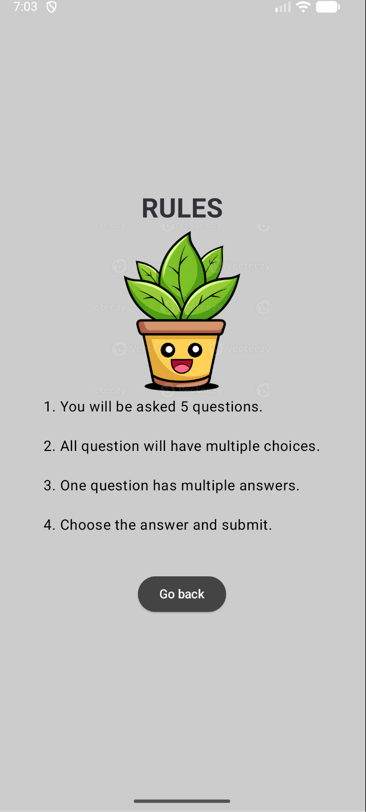
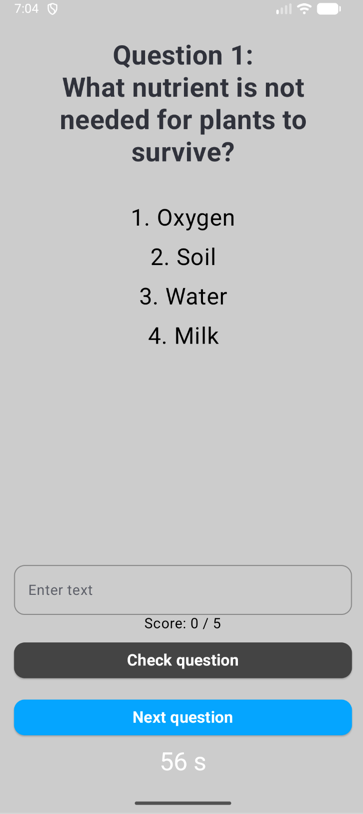
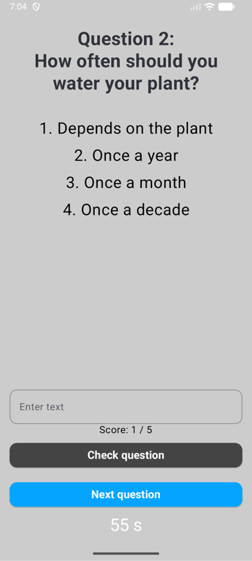
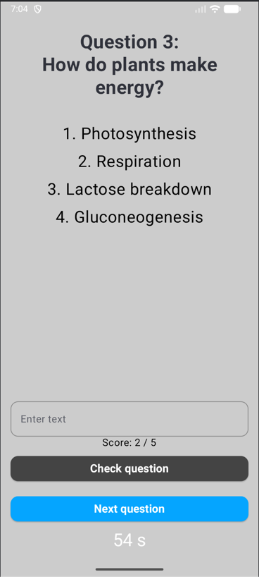
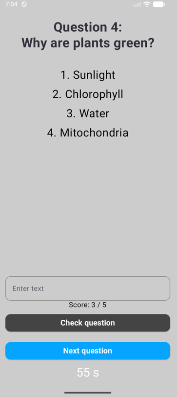
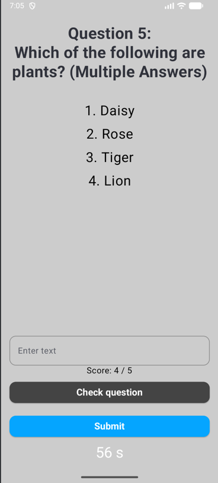

# CSC 371 Individual Project # 2

### Description: Quiz game with registration and login and a timer.

## Features:
1. 5 second Splash Screen and 
2. Login Screen
3. Register screen with validation
4. If the registration is successful you go on to the previous screen. 
5. Login Enabled with regex validation!
6. Once you log in you are taken to the game.
7. You can either play or read the rules.
8. Asks five questions.
9. User asks enters question and can check if they are correct.
10. Result displayed after the quiz. 
11. Data is stored.
12. Includes a timer.
13. Works on tablets and phones. 

